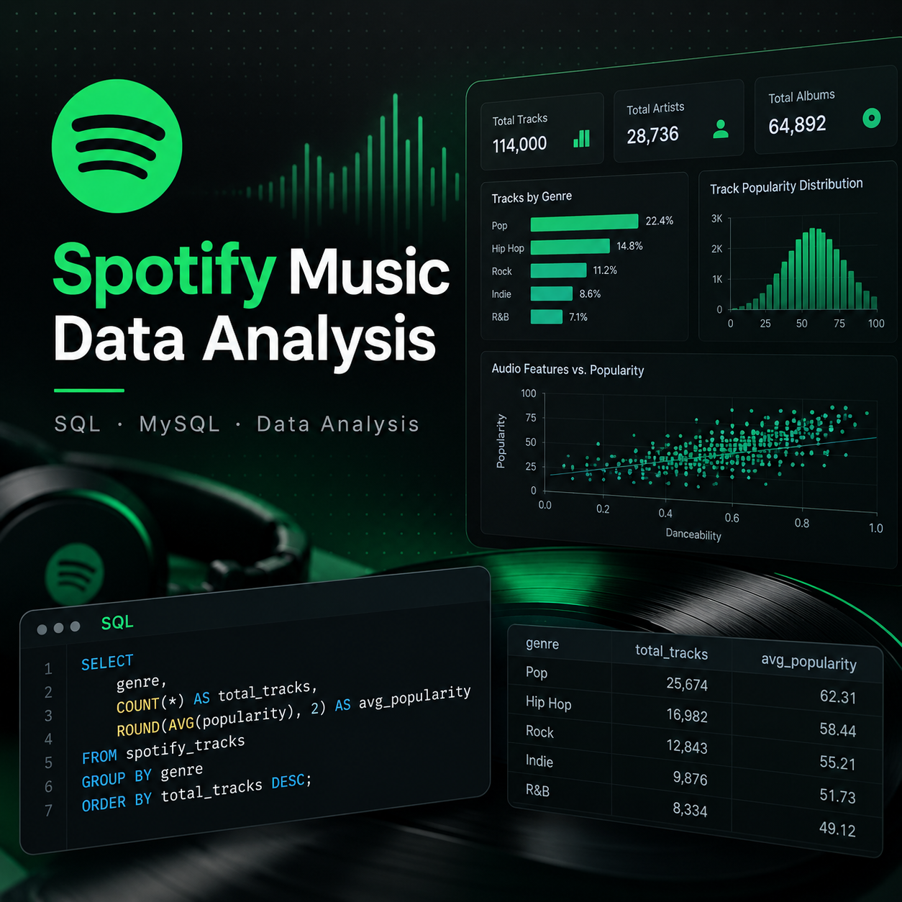

# Spotify Music Data Analysis



*Illustrative project cover created for portfolio presentation. The charts and metrics in the cover image are visual design elements and are not direct outputs from the SQL analysis below.*

**SQL · MySQL · Data Analysis**

## Project Overview

**Portfolio project:** SQL analysis of Spotify data focused on popularity, audio features, and music trends.

This project analyses four Spotify datasets covering **artists, albums, tracks, and audio features**. The goal was to use SQL to answer business-focused questions about artist popularity, track popularity, genre diversity, audio characteristics, and how selected music features vary across decades.

The analysis was completed in **MySQL Workbench** using joins, filtering, aggregation, common table expressions (CTEs), and window functions.

## Business Questions

The analysis focused on questions such as:

- Which artists had the highest follower counts?
- Which tracks ranked highest by Spotify track popularity?
- How many distinct genres contained the word `classical`?
- Which artists ranked highest and lowest by Spotify artist popularity, subject to minimum follower criteria?
- Which artists had the highest average speechiness, liveness, danceability, and instrumentalness?
- Which non-explicit, high-popularity tracks were the most danceable in each decade?

## Data

The project used four CSV datasets:

- `spotify_albums_data_2023.csv`
- `spotify_artist_data_2023.csv`
- `spotify_features_data_2023.csv`
- `spotify_tracks_data_2023.csv`

Together, these datasets contain information about:

- Artists
- Follower counts
- Genres
- Albums
- Track popularity
- Explicit-content flags
- Release dates
- Audio features including danceability, acousticness, energy, speechiness, liveness, and instrumentalness

> The original datasets are not included in this repository. The SQL assumes the same table structure used in the original project.

## Key SQL Techniques

This project demonstrates:

- `SELECT`, `WHERE`, `ORDER BY`, and `LIMIT`
- `JOIN` operations across multiple tables
- `GROUP BY`
- Aggregate functions including `AVG()` and `COUNT()`
- `COUNT(DISTINCT ...)`
- `ROUND()`
- Common Table Expressions (`WITH`)
- `ROW_NUMBER()` window functions
- `PARTITION BY`
- Duplicate handling with `SELECT DISTINCT`
- String and date handling using `LEFT()`, `CAST()`, and regular expressions

## Selected Findings

### 1. Top Artists by Followers

Artists were ranked by follower count in descending order.

In the dataset used for the project, **Ed Sheeran had the highest follower count**.

### 2. Most Popular Tracks

Tracks were joined to album data using `track_id`.

Because some tracks appeared through multiple album associations, a `ROW_NUMBER()` window function was used to retain one album association per track before ranking tracks by `track_popularity`.

### 3. Classical Genre Diversity

Filtering artist genres for the keyword `classical` identified **56 distinct classical-related genres** in the dataset.

### 4. Artist Popularity Comparison

Artists were ranked using Spotify's `artist_popularity` field, with follower count used as a secondary ranking factor.

A separate query identified the least-popular artists among those with at least **1,000 followers**.

### 5. Audio Feature Analysis

Average artist-level values were calculated for:

- Speechiness
- Liveness
- Danceability
- Instrumentalness

The analysis required joining album, feature, and artist data while removing duplicate track-artist pairs before aggregation.

### 6. Danceability Across Decades

A multi-table query combined album, track, artist, and audio-feature data.

Results were filtered to include only:

- Artist popularity of at least 70
- Track popularity of at least 70
- Non-explicit tracks

Tracks were grouped by decade and ranked using `ROW_NUMBER()` to identify the most danceable qualifying track in each decade.

The project analysis observed that danceability remained high in more recent decades, while acousticness generally declined across the selected decade-level results.

## Example Query

The following query ranks tracks by popularity while removing duplicate album associations:

```sql
WITH ranked_tracks AS (
    SELECT
        t.id,
        a.track_name,
        t.track_popularity,
        a.album_name,
        ROW_NUMBER() OVER (
            PARTITION BY t.id
            ORDER BY a.album_popularity DESC, a.album_name ASC
        ) AS rn
    FROM tracks t
    JOIN albums a
        ON t.id = a.track_id
)
SELECT
    track_name,
    track_popularity,
    album_name
FROM ranked_tracks
WHERE rn = 1
ORDER BY track_popularity DESC, track_name ASC
LIMIT 10;
```

## Repository Structure

```text
spotify-music-data-analysis/
├── README.md
├── spotify-data-analysis-dashboard.png
└── spotify_analysis.sql
```

## How to Run

1. Create a MySQL database.
2. Create the four tables using the schema in `spotify_analysis.sql`.
3. Import the Spotify CSV files into the matching tables.
4. Run the analysis queries in MySQL Workbench.

## Skills Demonstrated

**SQL · MySQL · Relational Databases · Data Cleaning · Data Aggregation · Window Functions · Data Analysis · Business Analytics**

## Project Context

This project was originally completed as part of **MIS202 – Managing Data and Information** at Deakin University.

It has been reformatted as a professional portfolio project to demonstrate practical SQL, relational database, and data-analysis skills.
